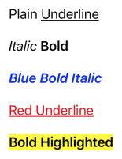
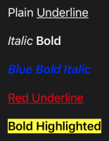

# AttributedStringBuilder

This microframework lets you easily build formatted `NSAttributedString` values in code. It uses the new function builder introduced in Swift 5.

## Usage

Call `AString()` to create an `AttributedStringComponent` value. `AString` takes a string and zero or more `Style` enum values, such as:

- `.bold`
- `.italic`
- `.underline`
- `.foregroundColor(UIColor)`
- `.backgroundColor(UIColor)`

So, to create an attributed string that looks like this: Plain *Italic* **Bold**

```swift
AttributedString {
    AString("Plain ")
    AString("Italic ", .italic)
    AString("Bold", .bold)
}
```

Rather than add a space at the end of the string contants passed to `AString`, you can use the `Space()` and `Newline()` functions. Both take an optional `count` argument allowing you to add multiple whitespace characters.

The `AttributedString` function builder returns an `AttributedString` object. This object can be rendered to an `NSAttributedString` for a given font, as seen in the example below.

## Example

```swift
// Returns an AttributedString instance:
let attributedString = AttributedString {
    AString("Plain")
    Space()
    AString("Underline", .underline)

    Newline(count: 2)

    AString("Italic", .italic)
    Space()
    AString("Bold", .bold)

    Newline(count: 2)

    AString("Blue Bold Italic", .bold, .italic, .foregroundColor(.blue))

    Newline(count: 2)

    AString("Red Underline", .underline, .foregroundColor(.red))

    Newline(count: 2)

    AString("Bold Highlighted", .bold, .foregroundColor(.black), .backgroundColor(.yellow))
}

// The AttributedString instance can be rendered into an NSAttributedString:
let rendered = attributedString.render(font: .systemFont(ofSize: 17))

// Or it can be passed directly to a UILabel:
let label = UILabel(frame: .zero)
label.render(attributedString)
label.sizeToFit()
```

Rendered in light mode:



Rendered in dark mode:



## Installation Instructions

Add to your `Podfile`:

```
pod 'RIAttributedStringBuilder', :git => 'https://github.com/RocketLaunchpad/RIAttributedStringBuilder.git', :branch => 'master'
```
