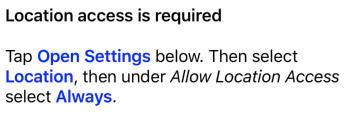

# AttributedStringBuilder

This microframework lets you easily build formatted `NSAttributedString` values in code. It uses the new function builder introduced in Swift 5.

## Motivation

Let's say you want to use a `NSAttributedString` in a `UILabel` to display a formatted message that gets built at runtime. For example:



Since it needs to be built at runtime, you cannot use Interface Builder to create the string.

We'll look at two ways of doing this with Apple's APIs then present how the equivalent would be done using `AttributedStringBuilder`

#### Building an `NSAttributedString` piecemeal

You could build it using Apple's `NSMutableAttributedString` API:

```swift
let string = NSMutableAttributedString()
string.append(NSAttributedString(string: "Location access is required", attributes: [.font: UIFont.boldSystemFont(ofSize: 17)]))
string.append(NSAttributedString(string: "\n\n"))
string.append(NSAttributedString(string: "Tap "))
string.append(NSAttributedString(string: "Open Settings", attributes: [.foregroundColor: UIColor.blue, .font: UIFont.boldSystemFont(ofSize: 17)]))
string.append(NSAttributedString(string: " below. Then select "))
// and so on...

label.attributedText = string
```

This is quite verbose. More importantly, you need to know the font and size in order to make text bold. Ideally, we would be able to use the label's font and just use a bold variant of it when constructing the attributed string. That's not possible if the label is not available when the string is being constructed.

#### Building an `NSAttributedString` from HTML

Apple provides a way to build an `NSAttributedString` from HTML:

```swift
let html = """
<b>Location access is required</b>
<br><br>
Tap <b>Open Settings</b> below. Then select <b>Location</b>, then under <i>Allow Location Access</i> select <b>Always</b>.
"""

guard let data = html.data(using: .utf8) else {
    return nil
}
let string = try? NSAttributedString(data: data,
                                     options: [.documentType: NSAttributedString.DocumentType.html],
                                     documentAttributes: nil)

label.attributedText = string
```

Lots of things going on here, and it's nowhere near what we want.

- The text is all black. To use color, we need to introduce CSS to the HTML document.
- The text will render in Times New Roman. We need to use CSS to get the label's font into the HTML document.
- This doesn't play well with dark mode. The text remains black even in dark mode.
- It seems overly complex to show a simple formatted string.

#### Using `AttributedStringBuilder`

```swift
import AttributedStringBuilder

let attributedString = AttributedString {
    "Location access is required"
        .bold

    Newline(count: 2)

    "Tap"
    Space
    "Open Settings"
        .bold
        .foregroundColor(.blue)
    Space
    "below. Then select"
    Space
    "Location"
        .bold
        .foregroundColor(.blue)
    ", then under"
    Space
    "Allow Location Access"
        .italic
    Space
    "select"
    Space
    "Always"
        .bold
        .foregroundColor(.blue)
    "."
}

// Render with a fixed font and display in a UILabel
label.attributedText = attributedString.render(with: .systemFont(ofSize: 17))

// Or, render with the UILabel's current font and display there.
label.render(attributedString)
```

This uses a Swift function builder to declaratively build an attributed string. This is the same mechanism that SwiftUI uses to build a view hierarchy.

The `AttributedString` instance can be constructed in advance of the UI. It then gets rendered using the desired font. You can do this directly by calling `render(with:)` on the `AttributedString` instance, or by passing the `AttributedString` to the `UILabel.render(_:)` function provided by an extension in this microframework.

## Usage

`AttributedString` objects are created using the `AttributedString` function builder. In the simplest case, passing a `String` constant or variable constructs an `AttributedString` with just that value:

```swift
AttributedString {
    "Hello"
}
```

You can then add arbitrarily many format modifiers. Currently supported are:

- `.bold`
- `.italic`
- `.underline`
- `.foregroundColor(UIColor)`
- `.backgroundColor(UIColor)`

So, to create an attributed string that looks like this: Plain *Italic* **Bold**

```swift
AttributedString {
    "Plain"
    Space
    "Italic".italic
    Space
    "Bold".bold
    Newline(count: 2)
    "Bold and Italic"
        .bold
        .italic
}
```

The `Space` and `Newline` symbols used above save from having to add trailing whitespace characters in string constants. Other similar symbols are available:

- `Space` adds a single space character
- `Space(count: Int = 1)` adds multiple space characters
- `Tab` adds a single tab character
- `Tab(count: Int = 1)` adds multiple tab characters
- `Newline` adds a single newline character
- `Newline(count: Int = 1)` adds multiple newline characters.

## Example

```swift
// Returns an AttributedString instance:
let attributedString = AttributedString {
    "Plain"
    Space
    "Underline".underline

    Newline(count: 2)

    "Italic".italic
    Space
    "Bold".bold

    Newline(count: 2)

    "Blue Bold Italic"
        .bold
        .italic
        .foregroundColor(.blue)

    Newline(count: 2)

    "Red Underline"
        .underline
        .foregroundColor(.red)

    Newline(count: 2)

    "Bold Highlighted"
        .bold
        .foregroundColor(.black)
        .backgroundColor(.yellow)
}

// The AttributedString instance can be rendered into an NSAttributedString:
let rendered = attributedString.render(font: .systemFont(ofSize: 17))

// Or it can be passed directly to a UILabel:
let label = UILabel(frame: .zero)
label.render(attributedString)
label.sizeToFit()
```

Rendered in light mode:


Rendered in dark mode:


## Installation Instructions

Add the following to the dependencies in your `Package.swift` file:

```swift
.package(url: "https://github.com/RocketLaunchpad/AttributedStringBuilder.git" from: "1.0.0")
```

